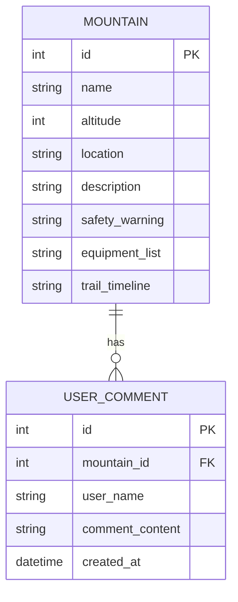

# 山資訊系統 - 資料庫設計文件 (DB Design)

## 1. ER 圖 (實體關係圖)

## 2. 資料表詳細說明

### 2.1 MOUNTAIN (山岳基本資料表)
儲存各大山岳的基本資訊、安全警示、裝備清單與路況時間軸。
- `id` (INTEGER): 唯一識別碼，Primary Key，自動遞增。
- `name` (TEXT): 山岳名稱，必填。
- `altitude` (INTEGER): 海拔高度 (公尺)。
- `location` (TEXT): 位置或地址。
- `description` (TEXT): 山岳簡介。
- `safety_warning` (TEXT): 安全警示指標內容。
- `equipment_list` (TEXT): 數位化裝備清單 (可儲存 JSON 字串或長文本)。
- `trail_timeline` (TEXT): 路況時間軸資訊 (可儲存 JSON 字串或長文本)。

### 2.2 USER_COMMENT (使用者評論表)
儲存使用者在各個山岳頁面發表的評論。
- `id` (INTEGER): 唯一識別碼，Primary Key，自動遞增。
- `mountain_id` (INTEGER): 關聯的山岳 ID，Foreign Key。
- `user_name` (TEXT): 留言者名稱 (MVP 階段採匿名或手填名稱，後續可擴充關聯 USER 表)。
- `comment_content` (TEXT): 評論內容，必填。
- `created_at` (DATETIME): 留言建立時間。
