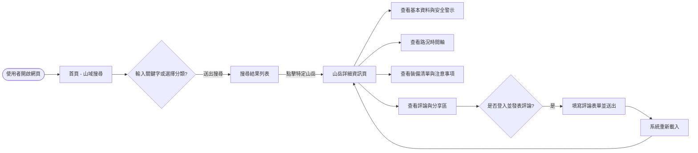
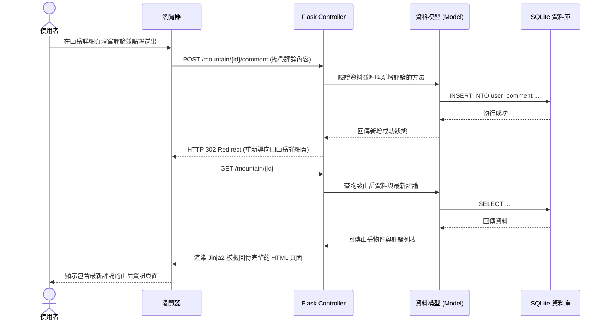

# 山資訊系統 - 流程圖設計 (Flowchart)

根據 PRD 與系統架構文件，以下為本專案的「使用者流程圖」與核心操作的「系統序列圖」，並附上對應的功能路由清單。

## 1. 使用者流程圖 (User Flow)

此流程圖展示了使用者進入網站後，如何進行搜尋、瀏覽山岳資訊以及發表評論的完整動線。

## 2. 系統序列圖 (Sequence Diagram)

此序列圖描述了核心互動流程：「使用者在某座山的頁面送出評論」到「資料存入資料庫並重新渲染頁面」的系統後端運作過程。

## 3. 功能清單與路由對照表

以下表格定義了各項功能所對應的 URL 路徑 (Routes) 與 HTTP 方法：

| 功能名稱 | URL 路徑 | HTTP 方法 | 說明 |
| :--- | :--- | :--- | :--- |
| **首頁與山域檢索** | `/` 或 `/search` | `GET` | 顯示首頁搜尋列，或根據 Query String (如 `?q=玉山`) 顯示搜尋結果列表 |
| **山岳詳細資訊** | `/mountain/<int:mountain_id>` | `GET` | 顯示單一山岳的完整資訊，包含安全警示、時間軸、裝備清單與歷史評論 |
| **發表評論** | `/mountain/<int:mountain_id>/comment` | `POST` | 接收使用者送出的評論表單資料，儲存後導向回詳細資訊頁 |
| **會員登入 (未來擴充)** | `/login` | `GET`, `POST` | 顯示登入頁面與處理登入邏輯 |
| **會員註冊 (未來擴充)** | `/register` | `GET`, `POST` | 顯示註冊頁面與處理註冊邏輯 |
